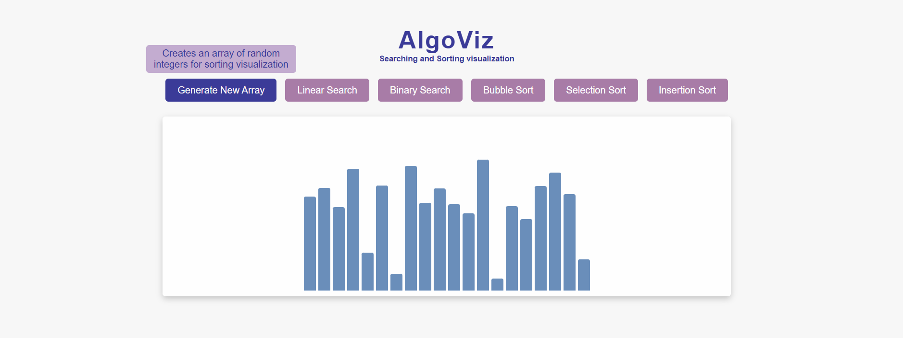
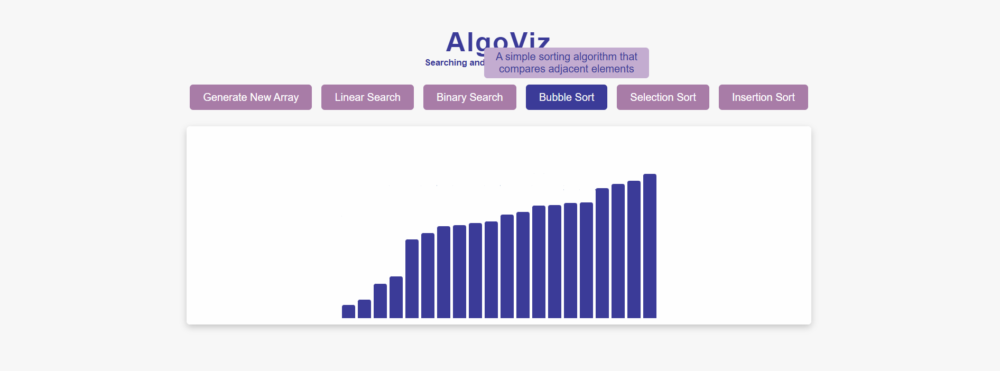
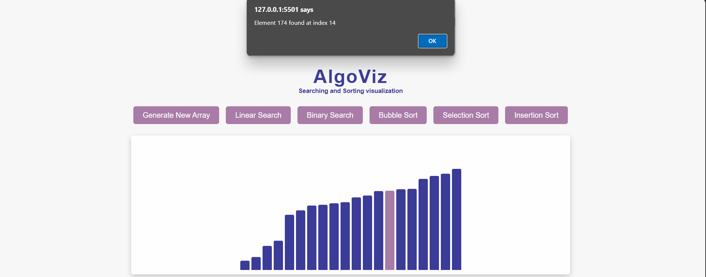

# Algorithm Visualization Project

Interact with the application to visualize algorithms in action!

## Demo Video

[Watch the demo video](videos/demo.mp4)

Welcome to the Algorithm Visualization Project! This interactive web application aims to provide a clear and engaging way to understand and visualize various sorting and searching algorithms. Whether you’re a student learning the fundamentals or a developer looking to reinforce your knowledge, this project serves as an educational tool to enhance your understanding of data structures and algorithms.

Features
Sorting Algorithms: Visualize popular sorting techniques, including:

Bubble Sort
Selection Sort
Insertion Sort

Searching Algorithms: Experience how searching works with:

Linear Search
Binary Search

Interactive Interface: Generate random arrays and see the algorithms in action with real-time visualizations.

Educational Tooltips: Hover over buttons to learn about the principles behind each algorithm, making it easier to grasp their functionalities.

Tech Stack
HTML/CSS: For structure and styling of the web application.
JavaScript: To implement the logic for sorting and searching algorithms and to handle interactivity.
GitHub Pages: For hosting and sharing the project.

Getting Started
To get a local copy up and running, follow these steps:
Clone the repository:
Open the index.html file in your web browser.

Interact with the application to visualize algorithms in action!
